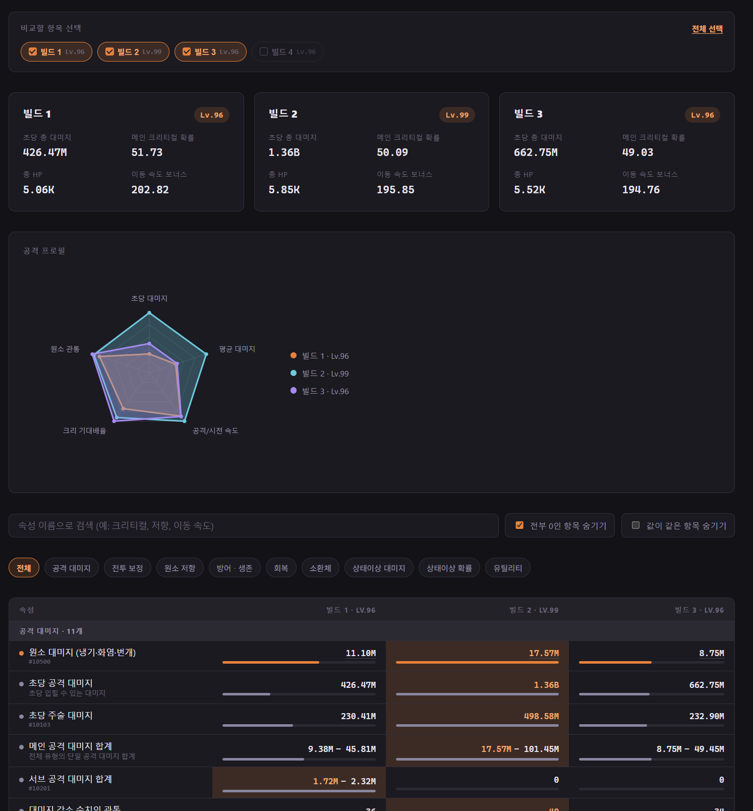
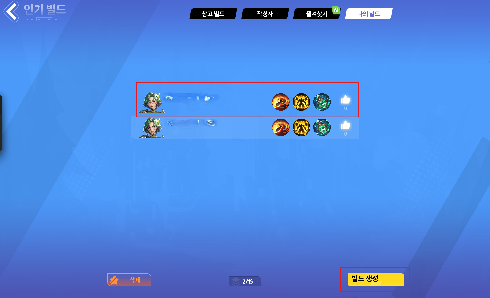
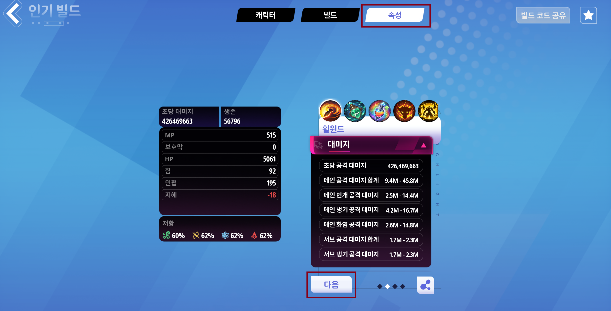

# tl-build-compare

Torchlight Infinite 캐릭터 종합 스탯(속성 탭) 비교 도구. `UE_game.log`를 브라우저에서 직접 읽어 분석하며, **서버 업로드가 전혀 없습니다** — 모든 처리가 내 PC의 브라우저 안에서만 이루어집니다.

**바로 사용:** https://listil.github.io/tl-build-compare/tl-build-compare.html

## 사용법

### 1. 게임에서 속성 데이터 남기기

**내 캐릭터**는 캐릭터 정보창에서 바로 보면 안 됩니다 — 그 순간 걸려있는 버프(오라·스킬 등)가 반영된 수치라 매번 달라집니다. 정확한(버프 없는) 기준 수치를 남기려면:

1. 인기 빌드 → **나의 빌드** 탭 → **빌드 생성**으로 내 빌드를 하나 만듭니다.

   

2. 생성된 빌드를 열어 **속성** 탭으로 들어간 뒤, 화면 아래 **다음** 버튼을 페이지가 끝날 때까지 눌러서 모든 페이지를 다 봅니다. 중간에 멈추면 뒤쪽 페이지의 속성(저항·유틸리티·회복 등)이 로그에 안 남아서 "부분 캡처"로 표시됩니다.

   

**다른 유저 빌드**도 동일합니다 — "빌드 참조" 화면에서 속성 탭에 들어가 **다음**을 끝까지 눌러야 그 사람의 전체 속성이 로그에 남습니다.

### 2. 로그 파일 열기

- 기본 위치: `...\Torchlight Infinite\UE_game\TorchLight\Saved\Logs\UE_game.log`
- 탐색기 주소창에 위 경로를 붙여넣거나, `Win+R` → `explorer` 뒤에 경로를 붙여서 바로 이동할 수 있습니다.
- 게임을 켜둔 상태에서도 로그는 계속 갱신되니, 속성 탭을 본 직후 그대로 열어서 쓰면 됩니다.

### 3. 웹 페이지에서 분석

위 링크(또는 로컬 `tl-build-compare.html`)를 열고, 방금 연 `UE_game.log` 파일을 페이지에 드래그하거나 클릭해서 선택합니다. 자동으로 로그를 분석해서 내 캐릭터 + 열어본 다른 유저 빌드들을 표로 비교해 보여줍니다.

## 기능

- **항목별 비교표**: 267개 속성을 카테고리(공격 대미지·전투 보정·원소 저항·방어·회복·소환체·상태이상 대미지/확률·유틸리티)로 묶어서 표시
- **오각형(펜타곤) 차트**: 초당 대미지·공격 속도·크리티컬 확률·크리티컬 대미지·원소 관통 5개 축으로 빌드를 겹쳐서 비교
- **검색 / 필터**: 속성 이름으로 검색, 0인 항목 숨기기, 값이 같은 항목 숨기기
- **부분 캡처 표시**: 다른 유저가 속성 탭을 끝까지 안 보고 나온 경우(일부 속성만 로그에 남은 경우) 뱃지로 표시하고 기본적으로 비교에서 제외
- **최소 ~ 최대 대미지 범위**: 대미지류 속성 중 로그에 두 값이 남는 항목은 범위로 표시

## 개인정보

- 로그 파일은 어디로도 전송되지 않습니다 (브라우저 File API로 로컬에서만 읽음)
- 닉네임·계정ID 등 신원 정보는 이 방식으로는 로그에 남지 않아 애초에 다루지 않습니다
- 개인 비교 목적의 로컬 분석 도구이며, 다른 사람 배포를 목적으로 하지 않습니다
